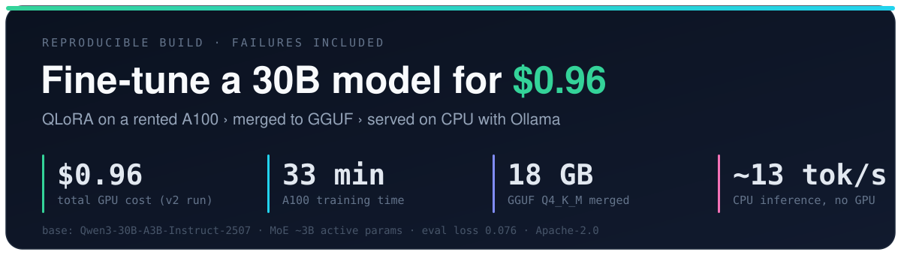
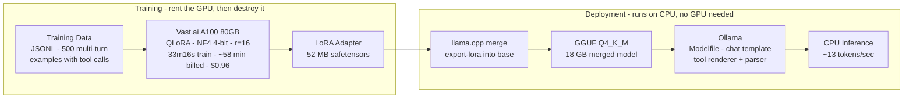

# QLoRA Fine-Tune: 30B MoE on a Budget



[](LICENSE)
[](https://huggingface.co/Qwen/Qwen3-30B-A3B-Instruct-2507)


Fine-tuned a 30B Mixture-of-Experts model to behave like custom Telegram bots.
Total cost: **$1.25** across two training runs. Deployed on CPU at **~13 tokens/second**.

The v1 run cost **$0.29** and failed. The v2 run cost **$0.96** and shipped to production.
This repo documents both - including the 9 attempts that broke before anything worked.

---

## Pipeline

Left side is the only part that needs a GPU. Rent the A100, train for ~33 min, then pull the 52 MB adapter and destroy the instance. Billed time is ~58 min (instance startup + dependency install + training), which is where the $0.96 comes from. Everything from the merge onward runs on CPU.



---

## Numbers at a glance

| | v1 (failed) | v2 (deployed) |
|---|---|---|
| Training time | 7m 29s | 33m 16s |
| Cost | $0.29 | $0.96 |
| Examples | 203 | 500 |
| LoRA rank | r=8 | r=16 |
| LoRA targets | q_proj, v_proj (2 modules) | all 7 (q,k,v,o + gate,up,down) |
| LoRA alpha | 16 | 32 |
| Max length | 512 | 1024 |
| Epochs | 3 | 5 |
| Eval loss | 0.509 | **0.076** (85% better) |
| Training loss | 2.621 -> 0.635 | 0.452 (avg) |
| GPU | A100 SXM4 80GB | A100 SXM4 80GB |
| VRAM peak | 59.8 GB | 59.8 GB |
| Adapter size | 13.4 MB | 52 MB |
| Merged model | 18 GB GGUF | 18 GB GGUF |
| Inference speed | 13.3 t/s (CPU) | ~13 t/s (CPU) |

---

## What we built

**Base model:** Qwen3-30B-A3B-Instruct-2507 (Mixture of Experts - ~3B active params per token)

**Pipeline:**
1. Generate JSONL training data (multi-turn conversations with tool calls)
2. Fine-tune on Vast.ai A100 80GB via QLoRA (4-bit NF4, BF16 compute)
3. Download the LoRA adapter (~52 MB safetensors)
4. Convert adapter to GGUF + merge into base GGUF with llama.cpp
5. Load into Ollama with a proper Modelfile (chat template + RENDERER/PARSER for tool calling)
6. Serve at 13 t/s on a CPU machine

**Why it's cheap:** You only rent the GPU for the training run (~33 min wall time, ~58 min billed). Then destroy it.
The merged GGUF runs on CPU at 13 t/s - no GPU needed for inference.

---

## Quickstart

### Prerequisites

- Python 3.10+
- A Vast.ai account with $2+ credit (sign up at vast.ai)
- A HuggingFace account with `HF_TOKEN` set
- Ollama installed on your inference machine
- llama.cpp built locally (for the merge step)

### 1. Install deps

```bash
pip install transformers peft datasets accelerate bitsandbytes psutil torch
```

### 2. Generate or prepare training data

```bash
# Run the included generator (produces data/sample_train.jsonl as a reference)
python scripts/gen_dataset.py --output data/my_train.jsonl

# Or bring your own JSONL. Format:
# {"messages": [{"role": "system", ...}, {"role": "user", ...}, {"role": "assistant", ...}]}
```

See `docs/dataset.md` for dataset design principles.

### 3. Provision a Vast.ai A100

```bash
# Search for cheapest A100 with enough disk
vastai search offers 'gpu_ram>=75 num_gpus=1 disk_space>=200 cuda_vers>=13.0 verified=true reliability>=0.95' -o 'dph asc'

# Rent and wait for "running" status
vastai create instance <ID> --image vastai/pytorch:cuda-13.0.2-auto --disk 200 --ssh
vastai show instances
```

Or use the provisioning script (wraps the above):

```bash
bash scripts/vastai_provision.sh
```

### 4. Upload and train

```bash
# Upload data + script to the instance
scp -P <PORT> data/my_train.jsonl scripts/finetune.py root@ssh<N>.vast.ai:/workspace/

# SSH in and install deps
ssh -p <PORT> root@ssh<N>.vast.ai
/venv/main/bin/pip install transformers peft datasets accelerate bitsandbytes psutil

# Optional but recommended: Flash Attention 2 (5-10 min compile)
/venv/main/bin/pip install flash-attn --no-build-isolation

# Run training (HF_TOKEN required to download the base model)
export HF_TOKEN="your_huggingface_token"
/venv/main/bin/python finetune.py 2>&1 | tee training.log
```

### 5. Download adapter and destroy instance

```bash
# Download the adapter (~52 MB)
scp -P <PORT> -r root@ssh<N>.vast.ai:/workspace/my-adapter/ ./my-adapter/

# DESTROY the instance immediately - billing stops only when destroyed
vastai destroy instance <ID>
```

### 6. Merge adapter into base model

```bash
# See scripts/merge_adapter.sh for the full GGUF merge pipeline
bash scripts/merge_adapter.sh ./my-adapter/ qwen3-30b-base.gguf my-merged.gguf
```

### 7. Deploy with Ollama

```bash
# Edit Modelfile to point to your merged GGUF
# Then create the Ollama model
ollama create my-finetuned-model -f Modelfile

# Test it
ollama run my-finetuned-model "Hello, what can you do?"
```

---

## Docs

- `docs/method.md` - Full pipeline explanation
- `docs/hardware.md` - Why A100, Vast.ai search recipe, provision/train/destroy flow
- `docs/cost.md` - Detailed cost and time breakdown
- `docs/failures.md` - 9-attempt failure table with root causes (read this first)
- `docs/dataset.md` - How to build training data, multi-turn format, tool call format
- `docs/deployment.md` - llama.cpp merge, GGUF conversion, Ollama Modelfile, serving

---

## License

Apache 2.0. See `LICENSE`.
